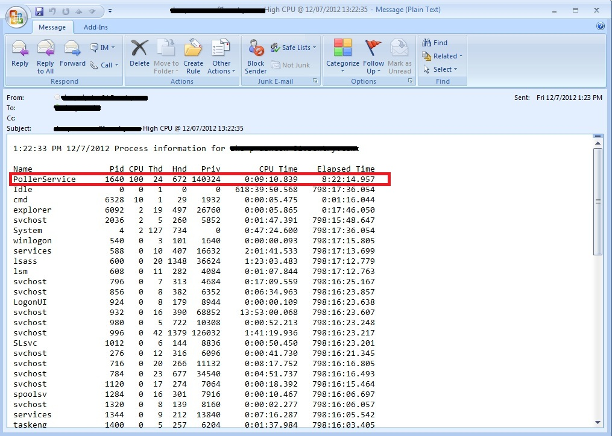
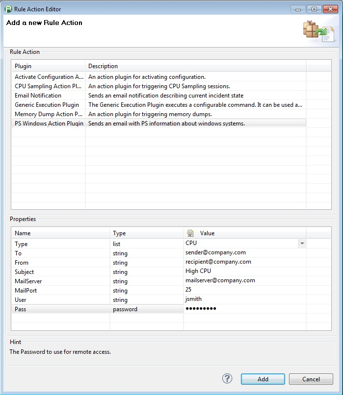

# Windows CPU and Memory Action Plugin

## Overview

The Action plugin will send an email with Process and CPU information about a Windows System via PS Tools. The plugin is hard coded to look at the pslist command at C:\PSTools\pslist.exe on the
dynaTrace Server.

## Plugin Details

| Name | Windows CPU and Memory Action Plugin
| :--- | :---
| Author | Derek Abing
| License | [dynaTrace BSD](dynaTraceBSD.txt)
| Support | [Not Supported ](https://community.compuwareapm.com/community/display/DL/Support+Levels#SupportLevels-Community)  
| Release History | 2013-03-12 Initial Release
| Download | [Windows CPU and Memory Action Plugin 1.0.0](com.mycompany.myplugin_1.0.0.jar) 

## Configuration

| Name | Value 
| :--- | :---
|Type | What type of information to include.
|To |Email Address to send the email to. For multiple email address seperate by a ';'.
|From |Email address for the message to be sent from.
|Subject |Subject of the email will be in the format of: <server> High <Type> @ <time> <Subject input>.
|MailServer |Address of the mail server to use for the email.
|MailPort |Port on the mail server to use.
|User |The Username to use for remote access.
|Pass |The Password to use for remote access.

## Installation

Import the Plugin into the dynaTrace Server. For details how to do this please refer to the [dynaTrace
documentation](https://community.compuwareapm.com/community/display/DOCDT61/Plugin+Management).

